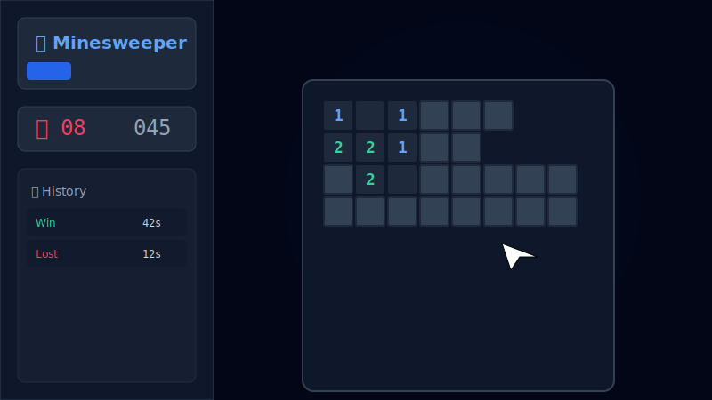

# 💣 扫雷 Pro (Minesweeper Pro)

[English Version](README_EN.md) | **简体中文**

一个画面精美、现代化的扫雷游戏，基于 **React**、**TypeScript** 和 **Tailwind CSS** 构建。

在线演示地址：[GitHub Pages Link](https://<YOUR_USERNAME>.github.io/<REPO_NAME>/) *(部署后请替换为您的实际链接)*



## ✨ 特性

*   **现代 UI设计:** 拥有流畅动画和毛玻璃效果的精致暗黑模式设计。
*   **响应式布局:**
    *   **桌面端:** 左右分栏布局，左侧展示控制面板和历史记录，右侧为沉浸式游戏面板。
    *   **移动端:** 优化的垂直布局，支持触摸操作，并提供便捷的“标记模式”切换按钮。
*   **多重难度:**
    *   初级 (9x9, 10 雷)
    *   中级 (16x16, 40 雷)
    *   高级 (16x30, 99 雷)
*   **游戏记录:** 自动本地保存最近 50 局游戏记录，包含游戏结果、耗时和日期。
*   **智能机制:** 首点安全机制（保证第一次点击绝对不会踩雷，且通常会打开一片区域）。

## 🛠️ 技术栈

*   [React](https://react.dev/) - UI 库
*   [TypeScript](https://www.typescriptlang.org/) - 类型安全
*   [Vite](https://vitejs.dev/) - 构建工具
*   [Tailwind CSS](https://tailwindcss.com/) - 样式引擎
*   [Lucide React](https://lucide.dev/) - 图标库

## 🚀 快速开始

### 前置要求

*   Node.js (v18 或更高版本)
*   npm

### 安装步骤

1.  克隆仓库：
    ```bash
    git clone https://github.com/yourusername/minesweeper-pro.git
    ```
2.  进入目录并安装依赖：
    ```bash
    cd minesweeper-pro
    npm install
    ```
3.  启动开发服务器：
    ```bash
    npm run dev
    ```

## 📦 部署指南

本项目已预配置 **GitHub Pages** 的自动化部署流程。

1.  将代码推送到您的 GitHub 仓库。
2.  进入仓库的 **Settings (设置)** -> **Pages**。
3.  在 **Build and deployment** 下，将 Source 选择为 **GitHub Actions**。
4.  项目包含的 workflow 文件 (`.github/workflows/deploy.yml`) 将会自动触发构建并将应用部署到 GitHub Pages。

## 📄 许可证

MIT
